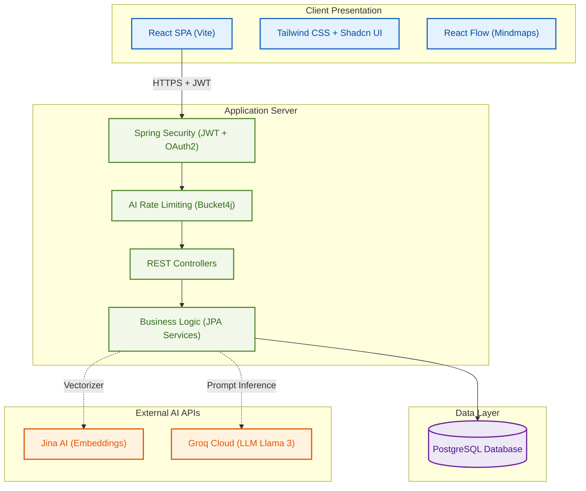

# 🎓 StudyHub - AI-Powered Collaborative Learning Platform

[](https://react.dev/)
[](https://spring.io/projects/spring-boot)
[](https://www.postgresql.org/)
[](https://vitejs.dev/)
[](https://tailwindcss.com/)
[](https://groq.com/)

**StudyHub** is a smart, collaborative learning platform designed to help students organize study materials, collaborate in groups, and leverage advanced AI capabilities to enhance their learning efficiency. By combining modern web technologies with **Retrieval-Augmented Generation (RAG)**, StudyHub converts static documents into interactive, context-aware AI learning companions.

---

## 🌟 Key Features

### 📁 Smart Document Vault
*   Upload and store slides, lecture PDFs, and textbook files.
*   Manage visibility (Public/Private) and follow courses for curated resources.
*   Track document views, download counts, and global tags.

### 💬 RAG-Powered AI Chat (Retrieve & Ask)
*   **Zero Hallucinations:** Ask questions directly to your uploaded materials.
*   The system splits documents into text chunks, vectorizes them, and queries matching contexts using **Jina AI Embeddings** and **PostgreSQL**.
*   Sends contextualized prompts to **Groq Cloud API (Llama 3/Mixtral LLM)** for instant, high-speed answers.

### 🧠 Automatic Study Generators
*   **Interactive Mindmaps:** Generates interactive, expandable, node-based mindmaps built using **React Flow (`@xyflow/react`)**.
*   **AI Flashcard Decks:** Instant flashcard deck generation for active recall.
*   **AI Quizzes:** Randomized interactive quizzes to self-assess understanding.

### 👥 Collaborative Study Projects
*   Create projects, link documents, and invite study groups.
*   Secure sharing using unique project tokens.

---

## 🛠️ Tech Stack & Architecture

StudyHub utilizes a robust **3-Tier Architecture**:



---

## 🔒 Security & Performance Hardening

StudyHub is engineered for robustness, featuring critical improvements in security and memory management:
*   **IDOR Protection:** Ownership checking via `SecurityContextHolder` validation prevents unauthorized access to private project documents and chat history.
*   **API Route Isolation:** Secured previously exposed sensitive administrative routes in Spring Security configurations.
*   **Memory Leak Fix (OOM Prevention):** Replaced heavy `.findAll()` scans in the JPA layer with targeted relational queries (`countBy...`, `findBy...`) to minimize JVM Heap consumption.
*   **Asynchronous Processing:** Long-running PDF parsing tasks are delegated to async worker pools using Spring `@Async` annotation, maintaining low-latency REST response times.
*   **JSON Injection Defense:** Leverages Jackson `ObjectMapper` in the Jina API client instead of manual string formatting to securely escape special characters.
*   **DDoS Protection:** Rate limiting filters shield Groq and Jina APIs from billing spikes.

---

## 📁 Repository Structure

The codebase is organized using a clean **Package-by-Feature** architecture with internal layering:

```text
├── backend/
│   ├── src/main/java/com/example/keeper/
│   │   ├── config/             # CORS, Security, Rate Limits, JWT Filters
│   │   ├── data/               # Data Seeding & Database Initializers
│   │   └── systems/            # Feature Modules (Layered internally)
│   │       ├── ai_ask/         # RAG Chat Engine, Groq & Jina Integrations
│   │       ├── ai_flashcard/   # AI Flashcard Generator
│   │       ├── ai_mindmap/     # AI Mindmap Parser
│   │       ├── project/        # Collaboration Groups
│   │       └── auth/           # SignUp, Login, Password Reset, OAuth2
│   └── schema.sql              # Database Schema Definition
└── frontend/
    ├── src/
    │   ├── components/         # Reusable UI components & layouts (Shadcn)
    │   ├── pages/              # Router Pages (Dashboard, AI Chat, Project view)
    │   ├── api/                # Axios Client Instance and endpoint bindings
    │   └── App.jsx             # React Router v7 & main app layout
```

---

## 🚀 Local Setup Guide

### Prerequisites
*   **Java JDK 21** or higher.
*   **Node.js v18+** & npm.
*   **PostgreSQL 15+** running locally or in a container.

### 1. Database Setup
Create a PostgreSQL database called `studyhub` (or configure your own name) and execute the SQL file located at:
```bash
psql -U postgres -d studyhub -f backend/schema.sql
```

### 2. Backend Configurations
Navigate to the `backend/` directory, copy the `.env.example` file to `.env`, and populate it:
```bash
cd backend
cp .env.example .env
```
Key environment variables needed in `backend/.env`:
```env
SPRING_DATASOURCE_URL=jdbc:postgresql://localhost:5432/studyhub
SPRING_DATASOURCE_USERNAME=your_db_user
SPRING_DATASOURCE_PASSWORD=your_db_password
JWT_SECRET=your_jwt_secret_key
OPENAI_API_KEY=your_openai_key
GROQ_API_KEY=your_groq_api_key
JINA_API_KEY=your_jina_api_key
```

Run the Spring Boot application:
```bash
./mvnw spring-boot:run
```

### 3. Frontend Setup
Navigate to the `frontend/` directory, create a `.env` file based on `.env.example`, and launch the development server:
```bash
cd ../frontend
cp .env.example .env
npm install
npm run dev
```

The application will be accessible locally at `http://localhost:5173/`.

---

## 👥 Contributors & License
This project is developed as part of the **SWP391 (Project Design)** course requirements. All code is private or licensed under the MIT License.
